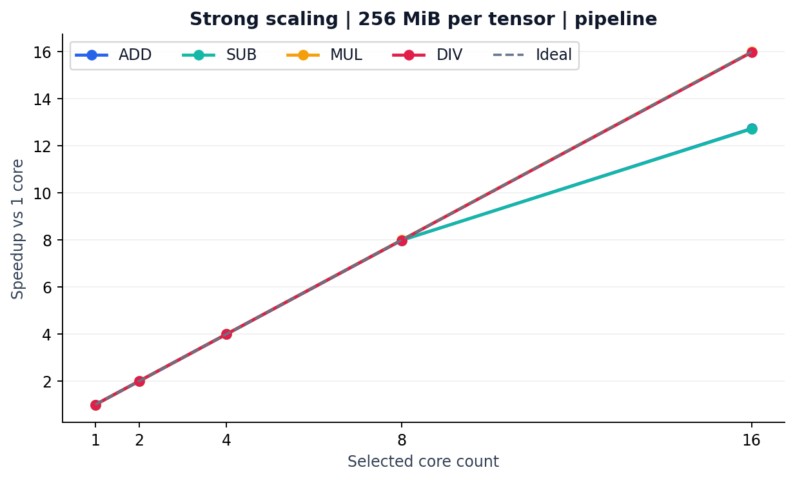
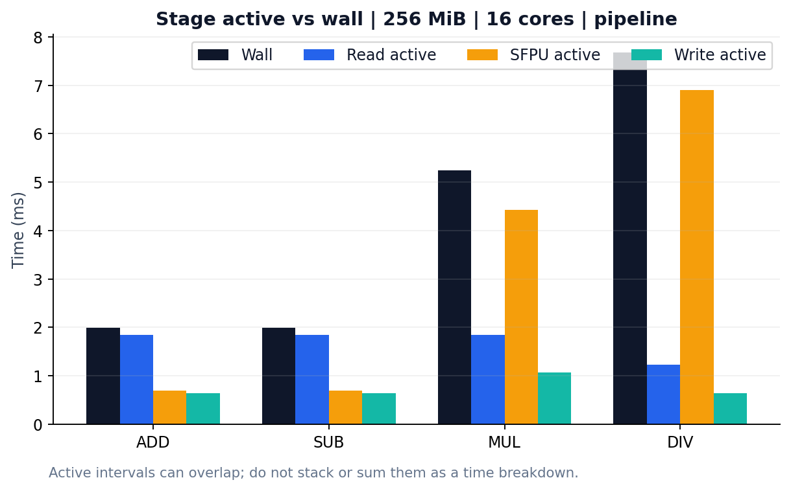
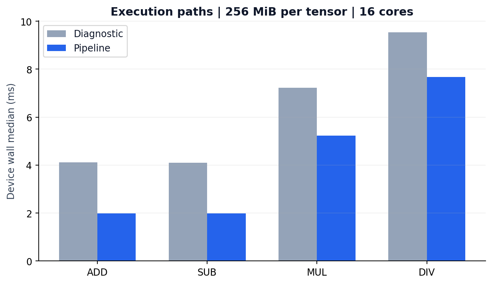
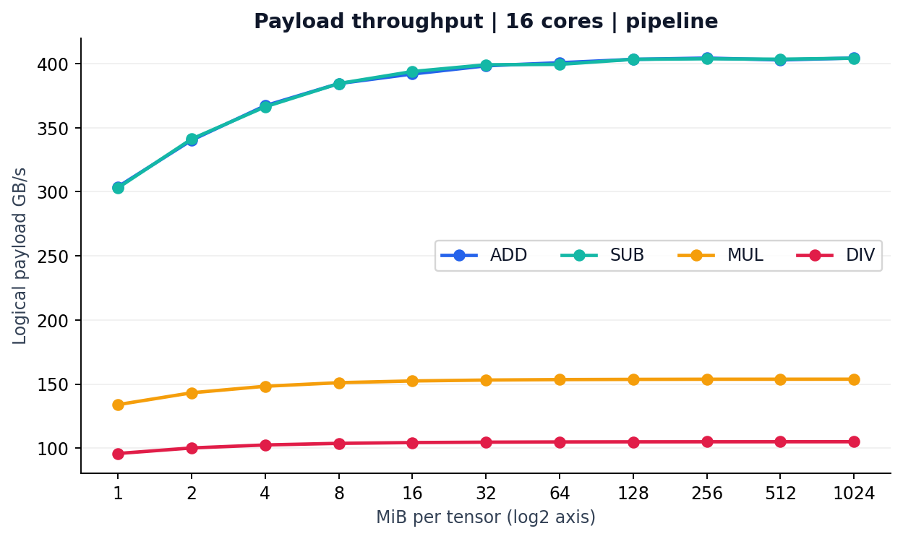
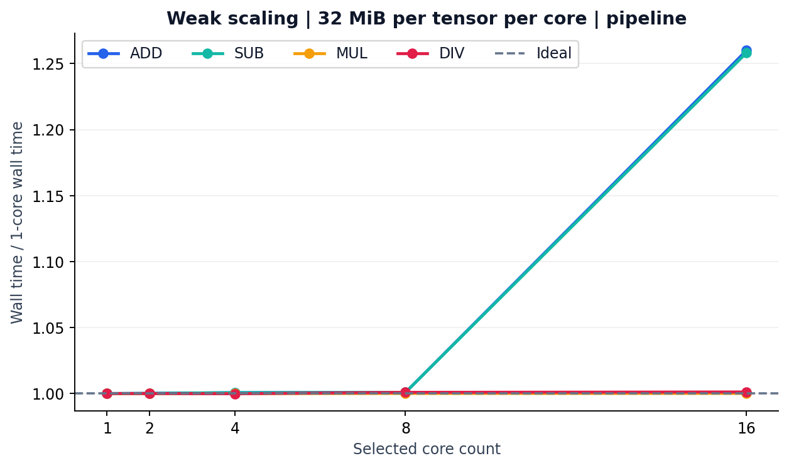
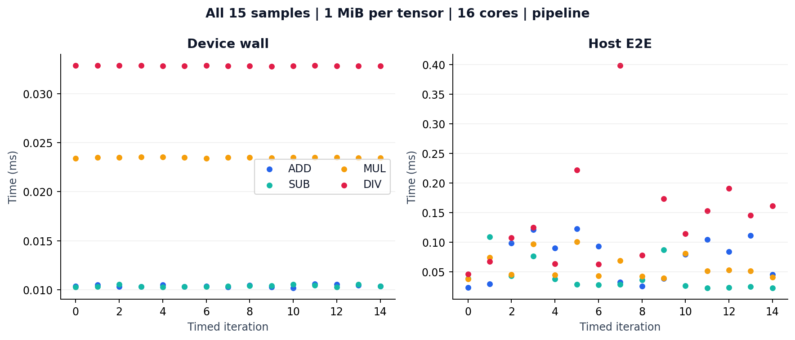

# P100a Benchmark K 분석

P100a/Blackhole의 대용량 BF16 원소별 ADD·SUB·MUL·DIV 실험을 분석했다. **ADD/SUB는 8→16코어에서 성능 확장이 둔화하고, MUL/DIV는 현재 SFPU 구현에서 16코어까지 거의 선형 확장한다.** DRAM과 NoC 중 어느 자원이 원인인지, MUL API의 높은 비용이 어디서 생기는지는 추가 검증 대상이다.

분석일: 2026-10-07. 두 제공 Excel은 같은 Benchmark K 실험의 상세본·종합본이다. 기존 A–J 실험은 이 자료에 포함되지 않는다. 이번 작업은 제공된 측정값의 분석이며 장치에서 새 벤치마크를 실행하지 않았다.

- [분석 Excel 다운로드](P100a_Benchmark_K_분석.xlsx): 설명, 원자료, 계산식, 편집 가능한 native 차트 9개
- [440조건 통계 CSV](data/benchmark_k_summary.csv)
- [6,600표본 원자료 CSV.gz](data/benchmark_k_raw.csv.gz)
- [원본 파일 식별·SHA256](data/source_manifest.json)

## 측정 조건과 시간 경계

| 항목 | 조건 |
| --- | --- |
| 장치 | P100a / Blackhole, device 0 |
| 클럭 | 기록상 1,350MHz, 설정 실행 전후 확인 |
| 자료형 | BF16 입력·출력, math_approx_mode=false |
| 연산 | blocking eltwise_binary_sfpu API의 원소별 ADD/SUB/MUL/DIV |
| 크기 | 1/2/4/8/16/32/64/128/256/512/1,024MiB |
| 코어 | 1/2/4/8/16, row-major 선택 |
| 경로 | diagnostic, pipeline |
| 조건·표본 | 4×11×5×2=440조건, 조건당 15회, 총 6,600표본 |
| 입력 상주 | 측정 전에 A/B가 DRAM에 상주 |
| 데이터 처리 | 8tile chunk를 L1 CB로 읽고 SFPU 계산 후 C를 DRAM에 기록 |

지정 MiB는 **A/B/C 텐서 각각의 크기**다. 256MiB 조건은 입력 두 개 읽기 512MiB와 출력 쓰기 256MiB, 총 768MiB의 논리 payload를 처리한다. 1GiB 조건도 전체 데이터를 L1에 올리는 구조가 아니라 작은 chunk로 스트리밍한다.

Device wall은 모든 코어의 reader/writer/math 시작 최소 시점부터 종료 최대 시점까지이며 최종 writer NoC write barrier를 포함한다. Host E2E는 EnqueueMeshWorkload 호출 시작부터 Finish 반환까지다. 초기 PCIe upload와 최종 download는 Host E2E에서 제외된다. 원본의 composed roundtrip은 별도로 측정한 구간의 비연속 합이며 연속 host→device→host 실측 시간이 아니다.

MUL은 원소별 곱셈이다. Conv/matmul의 matrix engine 성능으로 환산할 수 없다. [공식 SFPU 예제](https://docs.tenstorrent.com/tt-metal/latest/tt-metalium/tt_metal/examples/eltwise_sfpu.html)는 SFPU와 FPU 경로를 구분한다.

## 코어 확장성

256MiB/텐서, pipeline, Device wall median. 시간 단위는 ms.

| 코어 | ADD | SUB | MUL | DIV |
| --- | --- | --- | --- | --- |
| 1 | 25.368103 | 25.368085 | 83.771311 | 122.569559 |
| 2 | 12.687008 | 12.686933 | 41.886818 | 61.284743 |
| 4 | 6.347616 | 6.347596 | 20.944804 | 30.644699 |
| 8 | 3.175408 | 3.175452 | 10.473736 | 15.336853 |
| 16 | 1.991553 | 1.994282 | 5.237608 | 7.672321 |

| 연산 | 1→16 speedup | Strong 효율 | 8→16 gain | 8→16 시간 감소 |
| --- | --- | --- | --- | --- |
| ADD | 12.7378배 | 79.61% | 1.5944배 | 37.28% |
| SUB | 12.7204배 | 79.50% | 1.5923배 | 37.20% |
| MUL | 15.9942배 | 99.96% | 1.9997배 | 49.99% |
| DIV | 15.9756배 | 99.85% | 1.9990배 | 49.97% |

ADD/SUB는 8코어까지 거의 이상적인 확장이고 16코어에서 효율이 약 79.5~79.6%로 낮아진다. 그래도 8→16코어로 약 37% 시간을 줄이므로 8코어가 최적이라는 근거는 아니다. MUL/DIV는 16코어까지 약 99.8~100%의 strong scaling 효율을 보인다.

Strong efficiency는 `T1/TN/N`이다. 실제 코어 utilization을 직접 계측한 값이 아니다. `8→16 gain=T8/T16`, 시간 감소율은 `1−1/gain`이다. ADD의 gain 1.5944는 처리율 증가 59.44%, 시간 감소 37.28%를 뜻한다.

## 단계별 시간과 병목 가설

같은 256MiB·16코어·pipeline 조건. 시간 단위는 ms.

| 연산 | Wall | Read active | SFPU active | Write active |
| --- | --- | --- | --- | --- |
| ADD | 1.991553 | 1.844498 | 0.700127 | 0.639250 |
| SUB | 1.994282 | 1.846467 | 0.700043 | 0.638113 |
| MUL | 5.237608 | 1.840805 | 4.420970 | 1.065139 |
| DIV | 7.672321 | 1.229633 | 6.902632 | 0.642951 |

Read/SFPU/Write는 동일 critical core에서 해당 구간의 누적 active 시간이다. 코어별 시간을 더해 wall로 사용하지 않았다. Active 구간은 서로 겹칠 수 있어 누적 막대로 쌓거나 합을 전체 실행시간으로 읽으면 안 된다.

ADD에서 8→16코어로 늘리면 Read는 2.316501→1.844498ms, SFPU는 1.326807→0.700127ms다. SFPU는 약 1.895배 빨라졌지만 Read는 약 1.256배만 빨라졌다. 데이터 공급·공유 자원 경쟁과 일관된 패턴이다. **DRAM, NoC, 코어 배치, 요청 방식의 기여는 분리되지 않았다.**

MUL의 SFPU active는 wall의 약 84.4%, DIV는 약 90.0%에 해당한다. MUL은 8→16코어에서 Read가 1.832796→1.840805ms로 줄지 않아도 전체 wall은 거의 절반이 된다. 현재 경로에서 데이터 전송보다 계산 구간이 실행을 제한하는 근거다.

ADD diagnostic의 Compute phase는 1.778746ms, SFPU active는 0.693879ms다. 차이 약 1.084867ms에는 unpack/pack·대기 등이 포함된다. SFPU 시간만 전체 compute 비용으로 사용하면 과소평가한다. pipeline의 같은 Compute phase는 독립 계측하지 않아 원본 공란을 유지했다.

MUL SFPU가 ADD보다 약 6.31배 느린 정확한 이유는 미확인이다. [공식 Blackhole ISA](https://github.com/tenstorrent/tt-isa-documentation/blob/main/BlackholeA0/TensixTile/TensixCoprocessor/VectorUnit.md)에서 SFPADD와 SFPMUL은 모두 IPC 1, latency 2 cycles다. 따라서 이 시간 차이를 기본 곱셈 명령 자체의 비용으로 단정할 수 없다. 실제 SDK API와 생성 명령어를 확인해야 한다.

## Pipeline과 L1 비용

256MiB·16코어의 실제 두 실행경로 비교.

| 연산 | diagnostic ms | pipeline ms | 속도 향상 | 시간 감소 |
| --- | --- | --- | --- | --- |
| ADD | 4.113085 | 1.991553 | 2.0653배 | 51.58% |
| SUB | 4.104493 | 1.994282 | 2.0581배 | 51.41% |
| MUL | 7.234121 | 5.237608 | 1.3812배 | 27.60% |
| DIV | 9.537607 | 7.672321 | 1.2431배 | 19.56% |

동일 조건 220쌍 모두 Device wall 기준으로 pipeline이 빨랐다. 그러나 CB 용량도 diagnostic 48KiB/core→pipeline 96KiB/core로 증가한다. 16코어 기준 768KiB→1,536KiB이며 별도 계측 공간은 제외한 값이다. 실행 구조와 메모리 용량의 변경이 함께 있으므로 순수 overlap 효과로 부르지 않는다.

`Active 합−wall`도 순수 overlap 절감량이 아니다. ADD256MiB·16코어 pipeline의 active 합 median은 3.182884ms, signed 차이 median은 1.189551ms다. 누락된 unpack/pack/CB wait, 계측 경계, critical-core 선택을 함께 고려해야 한다. 각 stage median 합과 sample별 합의 median도 정확히 같을 필요가 없다.

## 데이터 크기와 최고 관측 처리율

16코어·pipeline의 논리 payload 처리율, 단위 GB/s.

| MiB/텐서 | ADD | SUB | MUL | DIV |
| --- | --- | --- | --- | --- |
| 1 | 303.924 | 303.078 | 133.945 | 95.818 |
| 2 | 340.269 | 341.185 | 143.171 | 100.141 |
| 4 | 367.182 | 366.303 | 148.278 | 102.475 |
| 8 | 384.459 | 384.476 | 151.075 | 103.740 |
| 16 | 391.928 | 393.852 | 152.424 | 104.342 |
| 32 | 398.308 | 399.133 | 153.129 | 104.662 |
| 64 | 400.725 | 399.458 | 153.485 | 104.837 |
| 128 | 403.333 | 403.384 | 153.653 | 104.921 |
| 256 | 404.361 | 403.808 | 153.755 | 104.963 |
| 512 | 402.886 | 403.471 | 153.770 | 104.985 |
| 1024 | 404.422 | 404.240 | 153.791 | 104.997 |

작은 데이터는 고정 비용의 영향이 크고, 큰 데이터에서는 처리율이 수렴한다. 동일 코어 수에서 크기를 두 배 늘리면 시간도 거의 두 배가 된다. 1GiB ADD의 404.422GB/s와 256MiB의 404.361GB/s 차이는 약 0.015%여서 1GiB가 유의미하게 최적이라는 근거가 약하다.

크기에 따른 처리율 수렴과 코어 수에 따른 포화는 다른 개념이다. 이번 측정에서 8→16코어는 모든 연산을 더 빠르게 한다. 16코어를 넘어선 최적 코어 수는 측정되지 않았다.

최고 관측값은 모두 1,024MiB/텐서·16코어·pipeline에서 나왔다.

| 연산 | wall ms | Device GB/s | Host GB/s | wall GElements/s |
| --- | --- | --- | --- | --- |
| ADD | 7.965018 | 404.421630 | 403.074145 | 67.403605 |
| SUB | 7.968606 | 404.239525 | 403.127564 | 67.373254 |
| MUL | 20.945535 | 153.790557 | 152.831061 | 25.631760 |
| DIV | 30.679225 | 104.996963 | 104.547592 | 17.499494 |

## Weak scaling

코어마다 32MiB/텐서를 유지하고 전체 작업량을 늘린 결과다. 시간 단위는 ms. 이상적이라면 실행 시간이 유지된다.

| 연산 | 1core·32MiB | 8core·256MiB | 16core·512MiB | 1→16 시간 증가 |
| --- | --- | --- | --- | --- |
| ADD | 3.172678 | 3.175408 | 3.997684 | 26.003% |
| SUB | 3.172666 | 3.175452 | 3.991896 | 25.822% |
| MUL | 10.472976 | 10.473736 | 10.474157 | 0.011% |
| DIV | 15.322753 | 15.336853 | 15.341298 | 0.121% |

ADD/SUB는 코어당 작업량이 같아도 16코어에서 약 26% 느려진다. 따라서 strong scaling 둔화를 작은 코어당 작업량만으로 설명하기 어렵다. MUL/DIV는 코어당 작업을 거의 동일한 시간에 완료한다.

## Host 변동성

1MiB/텐서·16코어·pipeline. Host 통계는 이번에 원본 15표본에서 추가 계산했다. 원본 Excel의 SD/CV는 Device wall 통계다.

| 연산 | Device median ms | Host median ms | Host p95 ms | Host CV |
| --- | --- | --- | --- | --- |
| ADD | 0.010350 | 0.084227 | 0.121425 | 50.31% |
| SUB | 0.010379 | 0.028483 | 0.093408 | 63.41% |
| MUL | 0.023485 | 0.050993 | 0.097946 | 36.49% |
| DIV | 0.032830 | 0.124475 | 0.275156 | 63.08% |

ADD와 SUB의 Device 시간은 거의 같은데 Host 중앙값은 약 3배 차이 난다. 산술 성능 차이로 해석할 수 없다. MUL1MiB·4코어 pipeline은 Host 0.092445~2.175793ms, CV 약 229.4%지만 Device CV는 약 0.0343%다. 작은 작업의 최적 코어 수나 고정 launch overhead를 이 sweep의 Host 중앙값만으로 결정하면 안 된다.

Device 기준 220쌍 모두 pipeline이 빨랐지만 Host 중앙값은 4조건에서 역전됐다: ADD1MiB·8core, SUB1MiB·8core, SUB2MiB·16core, DIV1MiB·16core. 순서 무작위화·반복 sweep·Host p95를 추가하여 확인할 문제다.

## 단위, 계산식, 검증 한계

| 지표 | 정의 |
| --- | --- |
| MiB | 2^20bytes. GB/s의 GB는 10^9bytes |
| BF16 원소 수 | 텐서 bytes / 2 |
| 논리 traffic | 입력 A+B 읽기와 C 쓰기 = 3×텐서 bytes |
| Device GB/s | traffic / device wall(ms) / 10^6 |
| Host GB/s | traffic / Host E2E(ms) / 10^6 |
| SFPU GElements/s | 전체 원소 수 / critical-core SFPU active(ms) / 10^6 |
| Device GElements/s | 전체 원소 수 / device wall(ms) / 10^6 |
| CV | 표본 SD / 평균. 표본 분산의 분모는 n−1 |
| p95 | 15표본 정렬 위치 13.3(0부터)을 선형 보간 |

ADD256MiB·16core에서 134,217,728원소와 805,306,368bytes를 처리한다. Device wall 1.991553ms로 나누면 67.393489GElements/s와 404.360935GB/s다. SFPU active 0.700127ms로 나누면 191.704922GElements/s다. 시간 분모가 다르므로 세 값을 섞지 않는다. SFPU rate는 코어 하나의 처리율도 아니다.

[공식 P100a 명세](https://ko.tenstorrent.com/hardware/cards)의 메모리 대역폭은 448GB/s다. 404.42GB/s는 명세의 약 90.3%에 해당하는 논리 payload rate이며 물리 transaction 또는 이용률을 직접 측정한 결과가 아니다.

특히 원본 Read/Write GB/s는 전체 payload를 critical core의 stage active 누적시간으로 나눈 값이다. 전칩의 연속 시간창에서 물리 transaction을 센 값이 아니므로 DRAM 사양과 직접 비교하지 않는다. 일부 값은 448GB/s를 넘는다. 원본 요약의 최대 Read·SFPU는 pipeline 행만 대상으로 한다. 제목에 경로 조건을 표시해야 정확하다.

440조건×15회 반복 번호 0~14의 누락·중복은 없다. 상세본의 통계·처리율·speedup 등 8,360값, 종합본 주요 4,400값이 독립 계산과 일치했다. 이번 Excel은 중앙값·p95·SD·CV 등을 원시표본 참조 수식으로 작성했다.

정확성 사전·최종 full-output 검증과 clock wrap 통과는 제공 파일의 기록이다. 커널 소스·출력을 재실행 검증하지 않았다. sweep 입력의 분모 B는 0.5~2.0이고 모든 연산의 허용오차는 `abs(error) ≤ 0.015 + 0.015×abs(reference)`로 기록되어 있다. 별도 경계 사례 기록도 있으나 임의 입력 전체 정확성을 입증하지 않는다.

ADD/SUB/MUL330조건은 timer v1, DIV110조건은 v2 재측정값이다. 초기 DIV110조건/1,650표본을 대체한 이력이 있다. 전체 instrumentation overhead는 무계측 실행과 독립 비교하지 않았다. 15회 p95는 이 15표본 내 값이며 장기간 tail latency 보장이 아니다.

## 다음 실험과 자동 분할 모델

1. MUL 실제 SFPU API·생성 명령어를 확인해 높은 코어당 계산 비용을 분해한다.
2. ADD/SUB 코어 배치와 DRAM/NoC 요청 분산을 바꿔 16코어 공급 제약을 구분한다.
3. chunk 크기와 CB 깊이를 바꾸되 L1 추가 사용량과 처리율을 함께 기록한다.
4. 작은 작업은 순서 무작위화와 반복 sweep으로 Host 변동성을 확인한다.

자동 코어 분할 비용 모델에는 연산별 처리율, 코어 수별 전송 특성, 데이터 크기의 고정 비용, 버퍼 용량을 분리해서 넣는다. 하나의 코어당 GB/s를 모든 연산에 적용하면 이 결과를 설명하기 어렵다. Conv의 M/N/K 결정에는 matmul, peer transfer, gather/halo, reduction, 레이어 간 재사용 비용을 추가 측정해야 한다.
